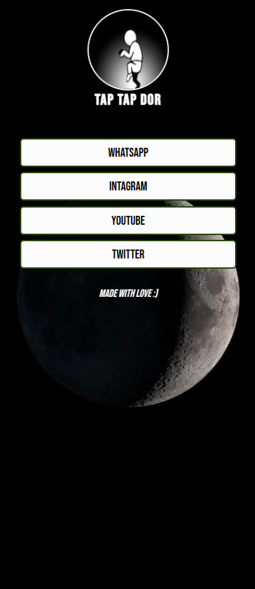
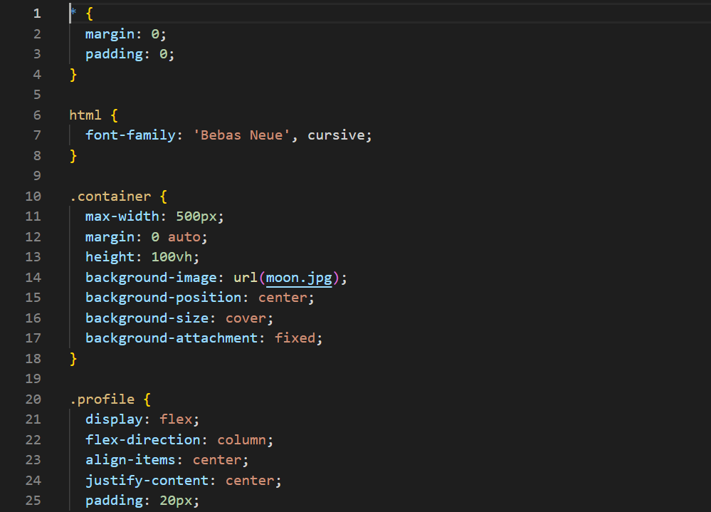
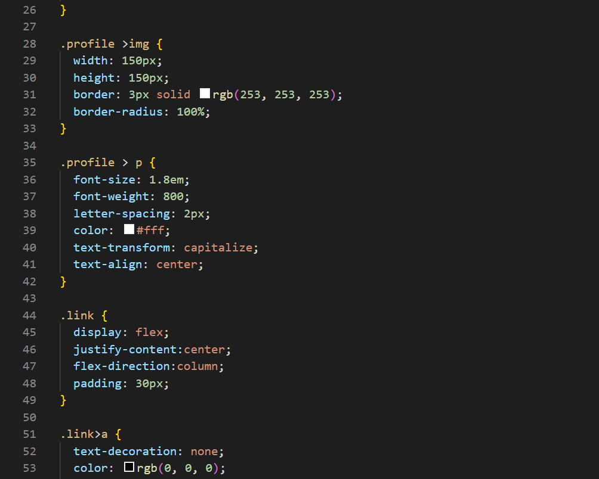
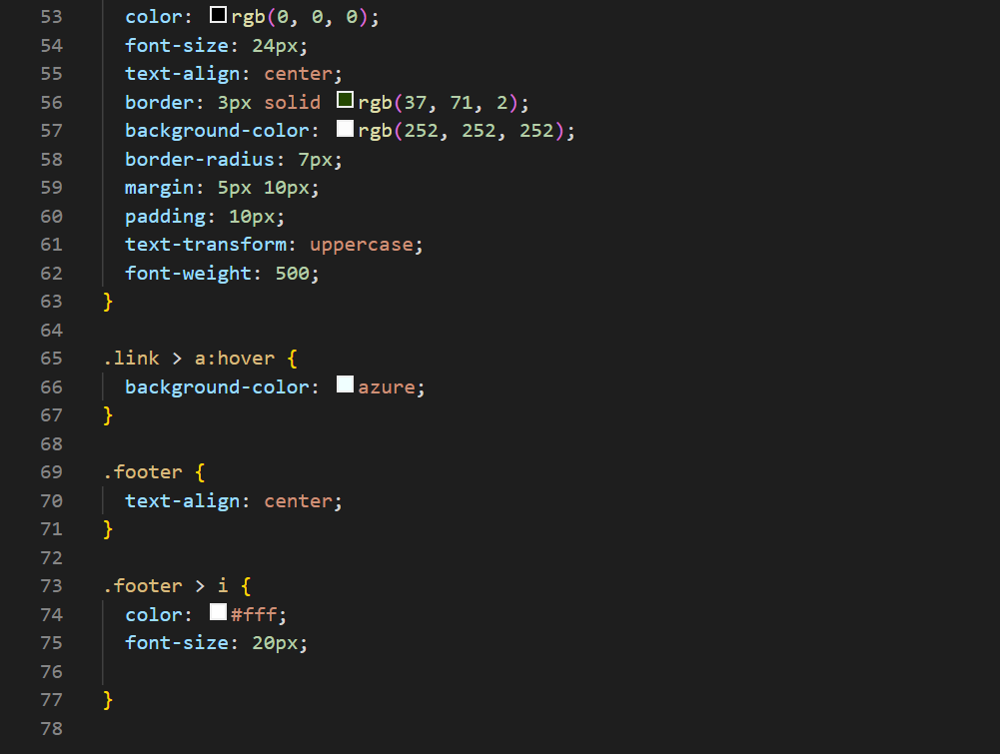

# Project_WEB_Dasar

Project yang saya kerjakan hanya menggunakan Cascading Style Sheets (CSS) karena ini adalah pengalaman awal saya dalam membuat web. disini saya menggunakan apk VS Code.

## TAMPILAN WEB

## TAMPILAN FRONT END

# Have a nice day